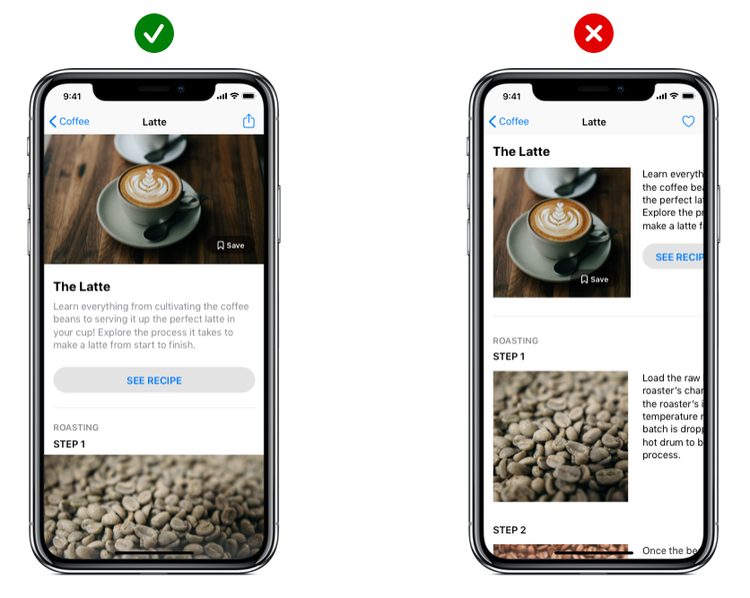

# UI 디자인

- UI (User Interface) 디자인은 사용자가 제품을 어떤 방식으로 이용하도록 만드느냐를 디자인하는 것입니다. 즉, 겉으로 시각화되는 작업이라고 보시면 됩니다. 사용자가 실제로 마주하게 될 디자인, 레이아웃 등을 아우르는 개념입니다.

<br><hr><br>

## 1. GUI 디자인 콘셉트 도출하기

### 1-1. UI 디자인 기본 원칙

- 매력적인 사용자 경험을 통해 견고한 인터페이스 디자인을 기반으로 깔끔하고 효율적이며, 심미성이 묻어 나올 수 있도록하는 디자인으로 상호 작용성, 가독성, 그래픽, 명확성을 고려하는 디자인 원칙

<br>

#### 1-1-1. 상호 작용성

##### 콘텐츠 형식 지정

- 기기 화면에 맞는 레이아웃을 생성하십시오. 사용자가 기본 콘텐츠를 확대/축소 또는 가로로 스크롤하지 않고 볼 수 있어야 합니다.



<br>

##### 터치 제어기

- 터치 동작을 위해 설계된 UI 요소를 사용하여 앱과의 상호 작용이 쉽고 자연스럽게 느껴지도록 합니다.


<br>

##### 대상 탭하기

- 손가락으로 정확하게 탭할 수 있도록 크기가 최소 44pt x 44pt인 제어기를 생성하십시오.


<br><br>

#### 1-1-2. 가독성

##### 텍스트 크기

- 텍스트 크기를 11포인트 이상으로 하여 일반적인 거리에서 화면을 확대하지 않고도 텍스트가 선명하게 보일 수 있게 합니다.


<br>

##### 대비

- 텍스트가 선명하게 보이도록 서체 색상과 배경 간에 대비가 명확해야 합니다.


<br>

##### 간격

- 텍스트가 겹치지 않도록 하십시오. 행 높이와 문자 간격을 늘려 가독성을 향상할 수 있습니다.


<br><br>

#### 1-1-3. 그래픽

##### 고해상도

- 모든 이미지 애셋의 고해상도 버전을 제공하십시오. @2x 또는 @3x가 아닌 이미지는 Retina 디스플레이에서 흐릿하게 나타납니다.


<br>

##### 왜곡

- 항상 의도한 가로 세로 비율로 이미지를 표시하여 왜곡을 방지하십시오.


<br><br>

#### 1-1-4. 명확성

##### 구성

- 제어기를 수정하는 콘텐츠 가까이에 배치하여 읽기 쉬운 레이아웃을 생성하십시오.


<br>

##### 정렬

- 텍스트, 이미지, 버튼을 정렬하여 사용자에게 정보의 연관성을 보여 주십시오.


<br><br>

### 1-2. 색(Color)

```
 색(Color)는 자극을 주는 시각 언어입니다. 화면 내에서 사용자를 행동하게 하거나 반드시 알아야 하는 정보를 강조하기 위해 주로 사용하는 요소입니다.
```

<br>

#### 1-2-1. 색 속성

```comment
색은 3가지 속성이 있습니다. 고유한 색의 종류를 구분한 색상 (hue), 원색의 진하기로 구분한 채도(Saturation), 밝고 어두움을 구분하는 명도(Brightness)가 있습니다. 이 3가지 요소를 이용해 다양한 시각 효과를 만듭니다.
```


- 형태로 구성하고, 색으로 강조하고, 용도에 따라 색을 바꿉니다.


<br>

#### 1-2-2. 색 공간

```comment
디자인할 때 사용하는 색, 컴퓨터가 처리하는 색, 모니터가 표시하는 색 모두 각자의 규격에 따라 표시되는 색이 달라집니다. 이 중 색 공간은 디지털 디바이스에서 다양한 색을 표시하기 위한 규격입니다. 디지털 프로덕트에서 색은 주로 RGB, HSL, HSB 등이 있으며 작업 시에는 HEX와 RGB를 주로 사용합니다.  
```

- RGBA(Red, Green, Blue, Alpha): 빛의 삼원색인 빨강, 초록, 파랑과 투명도를 나타내는 Alpha를 조합해 다양한 색을 표현하는 기본적인 방식입니다.
- HSV/HSB(Hue, Saturation, Value or Brightness:  색의 속성을 직관적으로 다루기 쉬운 방식입니다.
- HEX: RGB를 16진법으로 변환한 코드로 다른 요소들보다 한 번에 복사 붙여 넣기 할 수 있는 장점이 있고 여러 환경에서 입력하기 쉬워 보편적으로 쓰이는 컬러 값입니다.
- 주요 프로그램 모두 HSB를 방식으로 색을 선택하고 표시는 Hex를 사용합니다.


<br>

#### 1-2-3. 주색과 보조색

```comment
서비스에서 사용되는 색 서비스에서는 기본적으로 주색 (Primary Color), 보조색 (Secondary Color), 흑백 (Black, White)를 사용합니다. 서비스의 성격에 따라 더 다양한 색상 조합을 정하기도 합니다. 서비스에서 사용할 색은 주로 브랜드 그래픽 시스템을 따릅니다.  
```

- 주색: 색이 필요한 곳에 가장 많이 사용하는 색
- 보조색: 주색이 사용되었고 다른 요소와 구분이 필요할 때 사용하는 색
- 흑백: 주로 배경과 글에 쓰이며, 가장 밝은 색과 가장 어두운 색


<br>

#### 1-2-4. 색 계층

```comment
페이지 내의 중요도에 따라 색을 사용합니다. 기본 골격은 흑백으로 구성하며, 기능이 있거나 꼭 알아야 하는 정보와 같이 중요한 요소는 주색과 보조색을 이용해 강조합니다. 이때 다른 정보와 다르게 특수한 상황에 인지나 행동이 중요한 요소일 경우 의미에 알맞은 색을 사용합니다.
```


- 중요한 최종 행동 요소와 이를 위해 반드시 확인해야 하는 정보를 강조합니다.

<br>

#### 1-2-5. 색 대비

```comment
색은 다른 색과 확연하게 구분되도록 충분한 대비가 있어야 합니다. 배경색, 다른 요소 들과의 상대적인 관계를 생각하며 색을 조정합니다. 색 대비는 WCAG에서 나눈 레벨을 따르며 주로 AA 레벨이 표준으로 쓰입니다.
```

- A (최소) - 3:1
- AA (중간)- 4.5:1
- AAA (최대 - 7:1

[Color Contrast Checker](https://colourcontrast.cc/)

- 콘트라스트 체크를 할 때 유용한 툴로 배경색과 텍스트의 대비 레벨을 측정할 때 사용합니다.


<br>

#### 1-2-6. 색 조합

```comment
주색을 정한 뒤 색상환을 기준으로 미리 사용할 색을 정합니다. 단색, 유사색, 보색을 활용해 스크린을 디자인할 때 명확한 기능이 있을 때 제한적으로 사용합니다.
```

- 단색(Monochromatic): 중요한 정보에 주색을 사용하고, 회색 영역도 주색과 같은 계열의 톤을 사용합니다.
- 유사색(Analogous): 비슷한 개념이지만 구분이 필요한 상황일 때 유사색을 사용합니다.
- 보색(Complemntary): 다른 요소보다 강력하게 강조할 필요가 있을 때 사용합니다.


<br>

#### 1-2-7. 색 비율

```comment
인테리어에서 사용되는 60-30-10 법칙을 활용할 수 있습니다. 60%와 30%를 이용해서 배경 색을 배분하고, 강조하고자 하는 요소나 글 위주의 서비스일 경우 10%를 배분합니다. 전체의 량을 생각하며 배경색을 배분한 뒤 포인트 컬러를 10% 내에서 조금씩 추가하는 방식으로 색 비율을 조정합니다.
```


- 목적에 따라 인테리어 공간 디자인이 달라지듯 공간에 알맞게 배색을 응용합니다.

<br>

#### 1-2-8. 밝은 색과 어두운 색

```comment
1개의 주색으로 정보를 구분하기 어려울 경우 밝은 색과 어두운 색을 사용합니다. 이때 주색보다 밝은 색, 주색보다 어두운 색을 정의하는데, 자연에서의 색 변화 규칙에 맞춰 밝기–채도–색조 순서로 색을 변형합니다.  
```

- 색을 어둡게: RGB 계열 색조로 움직이고 채도를 늘리고 밝기가 줄인다.
- 색을 밝게: CMY 계열 색조로 움직이고 채도를 줄이고 밝기를 늘린다.


<br>

#### 1-2-8-1. Why 1 자연에서의 색 변화

```comment
실제 자연에서는 빛이 강해지면 물체의 채도가 약해집니다.(사과 바로 앞에 손전등을 댔을 때를 상상해보세요) 색은 물질에 빛이 반사돼서 보이는데 눈이 구분할 수 있는 범위를 넘어 반사량이 너무 많으면 하얗게, 반사량이 너무 적으면 어둡게 보입니다. 물체의 색이 밝아지면 채도 감소, 밝기 증가이며 어두워지면 채도 증가, 밝기 감소인 것입니다.
```


<br>

#### 1-2-8-2. Why 2 색조 자체의 밝기

```comment
노란색은 밝아서 흰색 바탕에 쓰기 힘들고 파란색은 어두워 검은 배경에 쓰기 어려운 것 정도는 관찰할 수 있지만 다른 색상 간의 밝기 차이를 상상하기는 어렵습니다. 스크린에서 보이는 색조 자체의 밝기는 어떻게 알 수 있을까요?
```


- 일러스트레이터로 HSB 중 Hue를 조정하여 12가지 색을 지정했습니다. 그대로 복사한 다음 흑백으로 전환했습니다. 노란색과 파란색을 예측이 됐는데 나머지 색깔들은 그다지 규칙적으로 보이지 않습니다. 180도와 300도에 있는 색은 왜 밝아진 걸까요?


- 각 수치별로 그래프를 비교했을 때 Red Green Blue로 갈수록 어두워지고 Cyan Magenta Yellow로 갈수록 밝아집니다. RGB와 CMY가 기준으로 스크린은 빛의 삼원색을 사용하기 때문에 색이 많이 섞일수록 흰색에 가까워지므로 원색이 가장 많이 섞인 CMY가 밝아지는 것입니다.

<br>

#### 1-2-9. 배경과 색

```comment
색은 상대적이기 때문에 주변에 어떤 색이 있느냐에 따라 성질이 달라집니다. 다크 모드를 디자인할 때, 배경 색이 반전되기 때문에 같은 색을 사용하지 않고 각 테마에 알맞은 색을 사용합니다.  
```

- 어두운 배경 + 밝은 영역 + 어두운 내부 요소
- 밝은 배경 + 어두운 영역 + 밝은 내부 요소


<br><hr><br>

### 1-3. 타이포그래피(Typograph)


```comment
문자는 다른 시각 언어보다 구체적이고 정확하게 정보를 전달하는 언어입니다. 물체나 풍경 같은 것들은 아이콘이나 이미지로 알려주는 게 좋을 수 있지만, 행동이나 개념을 알려줄 때는 문자가 더 효율적입니다. 같은 문화권이라면 의미 전달이 확실하기 때문에 가장 많이 쓰이는 시각 요소입니다.
디지털 디바이스에서 타이포그래피는 정보 전달과 행동 유도라는 큰 목적이 있습니다. 유저의 행동이 바로 비즈니스에 연결되는 디지털 프로덕트에서 전달력이 뛰어난 타이포그래피가 중요합니다.
```

<br>

#### 1-3-1. 글꼴(Font)

```comment
글꼴은 일관된 규칙으로 디자인된 모둠으로 글씨체, 폰트 패밀리, 자족 등 다양한 언어로 불립니다. 글꼴은 종류에 따라 가독성과 판독성, 읽는 방식조차 다를 수 있기 때문에 불필요하게 주의력이 흩어지지 않도록 2가지 이하의 글꼴을 사용하는 것이 좋습니다.
```


뚜렷한 목적이 없다면 1가지 글꼴을 사용합니다.

<br>

#### 1-3-2. 굵기(Weight)

```comment
다양한 시각적 위계를 표현하기 위해, 여러 굵기를 제공하는 글꼴을 사용합니다. Black, Bold, Semibold, Medium, Regular, Light 등이 있으며 서체의 무게를 이용해 표현하고자 하는 내용 중 읽는 이에게 가장 중요한 정보부터 중요하지 않은 정보까지, 중요도에 따라 계층을 표현합니다.
```

무게를 이용해 정보를 더 쉽게 구분할 수 있게 돕습니다.


<br>

#### 1-3-3. 글자색(Color)

```comment
사용자가 텍스트를 빠르고 정확하게 이해할 수 있게 충분한 대비를 주어야 합니다. 서비스에서 텍스트는 흰색 바탕의 검은 글씨와 버튼 내부에 많이 쓰이는 편이며, 최소한 WCAG 권장 4.5:1 대비가 필요하며 가능한 대비를 크게 줍니다.
```


[Color Contrast Checker](https://colourcontrast.cc/)

하얀 배경에는 까만 글씨를, 어두운 버튼에는 하얀 글씨를 씁니다.

<br>

#### 1-3-4. 행간(Line height)

```comment
행간은 글줄과 글줄 사이의 간격을 뜻합니다. 좁은 공간에 여러 정보가 섞여 있으면 사람의 눈이 정보를 식별하기 어렵기 때문에 가능한 여백을 주어야 합니다. 위아래 글줄이 서로 들러붙어 면처럼 보이지 않고 선으로 보이도록 충분한 여백을 줍니다. 보통 글자 크기 x 1.6을 권장하는 편입니다.
```


특히 여러 줄이 되는 본문의 가독성을 위해 행간을 적용합니다.

<br>

#### 1-3-5. 자간(Letter Spacing)

```comment
자간은 글자와 글자 사이의 간격을 뜻합니다. 행간과 마찬가지로 연관성이 있는 정보끼리 거리가 너무 멀거나 가까우면 정보를 식별하기 어렵기 때문에 적절한 자간을 설정해야 합니다. 글자 크기가 커질수록 자간이 멀어 보이기 때문에 자간을 줄여주어야 하며, 글자 크기가 작아질수록 식별이 어려워지기 때문에 자간을 늘려주는 편입니다. 일반적으로 16pt~17pt의 본문에는 -0.3을 부여하는 편입니다.
```


자간이 넓거나 좁으면 서비스 전체의 완성도가 떨어져 보입니다.

<br>

#### 1-3-6. 정렬(Alignment)

```comment
글줄 정렬은 다섯 가지 종류가 있습니다. 가운데, 양끝, 오른 끝, 왼끝, 엇갈리기가 있으면 그중 보통 왼끝과 가운데 정렬을 많이 사용하는 편입니다. 3~4줄 이하의 글에서는 가운데 정렬을 읽기 편하지만, 5줄 이상의 글줄은 왼끝 정렬로 표현하는 것이 더 읽기 편합니다.
```
 


가운데 정렬로 된 긴 본문은 읽기 어렵습니다.

<br>

#### 1-3-7. 서체 시스템

```comment
글꼴의 속성을 이용한 다양한 시각 기법을 이용할 수 있지만, 매번 새로운 방법을 사용하면 전체를 관리하기 어려워집니다. 일관된 규칙으로 시각 기법을 유지하고 전체의 일관성을 유지하고 사용자가 균일한 리듬감을 가질 수 있도록 돕기 위해 필요한 것이 서체 디자인 시스템입니다.
```


명칭은 다르더라도 비슷한 개념으로 나누는 편이며, 보통 Display, Headline, Body, Caption 으로 나누는 편입니다. 서체 크기는 본문을 기준으로 하며 스마트폰, 태블릿, 노트북, PC, TV, 월 스크린 등 매체에 따라 본문의 크기가 달라집니다.

#### 모바일 웹 기준 예시

- Title: 29px ~ 40px (180%~220%)
- Subtitle: 20px ~ 30px (130%~150%)
- Body: 16px~20px
- Caption: 11px ~ 16px (70–80%)
- Minimal size: iOS-11pt. Android-12sp. Web-14px


#### 1-3-8. 디지털 디바이스 글꼴

```comment
다양한 환경에 최적화된 한글 글꼴은 제한적입니다. 메이저 디지털 디바이스에서 제공하는 기본 글꼴을 사용하는 편이며, 한글은 크게 4가지를 사용합니다. iOS 환경의 한글 서체인 Apple SD gothic NEO, 삼성 갤럭시 디바이스에서 사용하는 Samsung One, 안드로이드 기반 디바이스에서 쓰이는 Source Sans, 대표적인 웹 서비스 네이버의 나눔 고딕이 있습니다.
```


<br><hr><br>

### 1-4. 아이콘(Icon)

```comment
아이콘은 대상의 특징을 강조해 만드는 기호로 다른 언어보다 보편적으로 이해할 수 있는 시각 언어입니다. UI 아이콘, 픽토그램, 사인 등으로 대표되며 좁은 영역을 차지하면서도 의미를 전달할 수 있어 다양한 영역에서 쓰이고 있습니다. 다른 요소보다 개성을 부여하기 쉽고 시각 원리에 대한 실험을 할 수 있어 많은 디자이너의 사랑을 받고 있습니다.
```


<br>

#### 1-4-1. 아이콘의 쓰임새(Icon Usage)

```comment
UI 디자인에서 아이콘은 크게 앱 아이콘과 시스템 아이콘으로 사용합니다. 브랜드를 표현하기 위한 앱 아이콘과 사용자가 빠르게 정보를 이해하고 행동하기 위한 시스템 아이콘에 사용합니다.
```


<br>

#### 1-4-2. 아이콘의 스타일(Icon Style)

```comment
아이콘을 표현하는 방식은 Line, Fill, Colored, Image가 있습니다. 아이콘을 사용하는 공간에 따라 용도가 다르며 크게 행동에 대한 피드백을 주거나, 주목도를 높이기 위해 사용합니다.  
```

- Line, Fill: 기본적인 형태로 레이아웃에 배치됩니다.
- Colored: 행동에 대한 피드백을 주거나, 주목도를 높이기 위해 많이 사용합니다.
- Image: 높은 주목도가 필요할 때 사용합니다. 이모지 혹은 개성적인 아이콘을 사용하는 편입니다.


<br>

#### 1-4-3. 아이콘의 무게(Icon Weight)

```comment
스타일을 조합해 다양한 무게감을 만들 수 있습니다. 만약 주로 이미지가 주인공인 서비스라면 아이콘의 무게감이 최소화 되야 하며, 텍스트 위주의 서비스라면 사용자에게 시각적 즐거움을 전달하기 위해 무거운 아이콘을 사용하기도 합니다.
```


<br>

#### 1-4-4. 아이콘의 속성(Icon Properties)

```comment
아이콘을 구성하는 요소로 굵기(Thickness), 끝모양(Ends), 꺾임(Join), 둥글기(Radius)가 있으며 사용자가 빠르게 아이콘을 구분할 수 있게 최소한의 변화로 표현 규칙을 통일합니다.
```

- Thickness: 디지털 스크린은 표현할 수 없는 소수점을 반올림하기 때문에 1px, 2px을 사용했습니다. 때로는 스마트폰 스펙이 좋아지면서 소수점을 사용하기도 합니다.
- End & Join: 각진 끝, 둥근 끝이 있으며 부드러운 표현을 위해 라운드가 많이 쓰입니다.
- Radius: End와 Join 과 일관성을 위해 같은 규칙을 사용하며, 마찬가지로 부드러운 표현을 위해 라운드가 많이 쓰입니다.


<br>

#### 1-4-5. 그리드(Grid)

```comment
눈은 시각적 그리드와 윤곽선으로 아이콘을 구분합니다. 시각적 그리드란 같은 크기의 영역 안의 다양한 형태의 아이콘이 같은 무게감과 무게 중심을 갖게 하기 위한 그리드를 말합니다. 기하학으로 해체한 대상을 원, 정사각형, 직사각형, 정삼각형으로 구성된 그리드에 맞춰 제작합니다.
```


<br>

#### 1-4-6. 아이콘의 크기(Icon Scale)


여러 환경 속에서 원할한 관리를 위해 8px, 16px, 24px, 32px 등 8의 배수를 베이스라인으로 사용하는 편입니다. 모바일의 좁은 영역에서 주로 사용하는 시스템 아이콘은 범용성을 위해 4px 배수로 사용하기도 합니다.


<br>

#### 1-4-7. 명확성(Clarity)

```comment
사용자가 빠르게 이해할 수 있는 최소한 요소로 디자인합니다. 가능한 사용자가 익숙한 형태로 만들며 필요하다면 간단한 은유를 적용합니다. 복잡한 아이콘은 사용자가 무슨 의미인지 이해하지 못하거나, 이해하는데 오래 걸릴 수 있습니다.
```


<br>

### 1-4-8. 디테일(Detail)

```comment
아이콘이 가장 중요한 목표인 ‘빠른 정보 전달’ 을 위해서 좁은 영역 안에 디테일을 최소화 하는 것이 좋습니다. 특히 좁은 영역에 들어가는 시스템 아이콘의 경우 어떤 내용을 전달하는지 알 수 있는 최소한의 요소만 남기고 다른 장식적인 요소는 제거하는 것이 좋습니다.
```


<br>

#### 1-4-9. 일관성 Consistency

```comment
하나의 서비스에서 같은 기능을 하는 아이콘은 같은 스타일로 표현합니다. 사용되는 맥락에 따라 Fill과 Line 을 함께 쓸 수 있지만, 동일한 맥락 속에서 사용하는 아이콘은 같은 속성으로 표현합니다.
```


<br>

#### 1-4-10. 원근법(Perspective)

```comment
가급적 원근은 정면에서 바라본 모양으로 제작합니다. 실제 디지털 디바이스는 평면이며, 주로 평면의 카드 공간 위에 쓰이는 아이콘이 공간감이 느껴지면 인지 부조화가 느껴질 수 있습니다. 특별한 주목도를 위해 제한적으로 사용되기도 하지만 권장하지 않습니다.
```


<br>

#### 1-4-11. 익숙함(Familiarity)

```comment
보통 플랫폼에 상관 없이 동일한 아이콘을 사용합니다. 하지만 OS 플랫폼 내부에서도 자주 사용하는 스타일의 경우 사용자에게 가장 익숙한 형태인 OS 기본 템플릿을 사용하면 사용자가 의미를 더 빠르게 파악할 수 있습니다.
```


<br>

#### 1-4-12. 시각 보정(Optical Correction)

```comment
그래픽 디자인 툴의 한계로 시각 보정이 필요할 때가 있습니다. 아래 재생 버튼의 경우, 그래픽 툴은 레이어의 끝을 기준으로 정렬을 맞춥니다. 하지만 실제로 삼각형은 원이나 네모와 무게 중심이 다르기 때문에 조정이 필요합니다.
```


<br>


<br><br>


### 1-5. 레이아웃(Layout)

```comment
레이아웃은 특정 영역 안에 요소를 배치하는 것입니다. 스크린에서 사용하는 레이아웃은 정적인 화면 균형뿐만 아니라 서비스의 추상적인 공간의 구조를 적절하게 표현해야 합니다. 또한 다양한 스크린에서 표시되기 때문에 어떤 환경에서도 유사한 맥락으로 사용할 수 있도록 설계합니다.
```


<br>

### 게슈탈트 이론(Gestalt Theory)

```comment
게슈탈트 이론은 색, 텍스트, 이미지, 레이어 등의 요소를 배치할 때 가장 중요한 개념 중 하나입니다. 독일어로 ‘모양’, ‘형태’를 의미하며 , ‘전체는 개별 요소의 합이 아니다’를 주창하며 여러 가지 요소들이 결합되었을 때 시각적인 효과에 대한 이론입니다.
```

#### 1-5-1. 근접성(Proximity)

```comment
연관성이 있는 요소는 다른 요소들보다 가깝게 배치합니다. 근접성 원리는 서로 가까운 요소가 서로 관련이 있는 것으로 인식하는 현상으로 여러 요소가 있더라도 서로 가까운 요소를 그룹으로 인식합니다. 모양이나 색으로 그룹핑하는 것보다 강력한 방법입니다.
```


<br>

#### 1-5-2. 유사성(Similarity)

```comment
동일한 기능을 하는 요소는 동일한 모양으로 표현하고 배치합니다. 유사성은 시각적으로 비슷한 요소를 그루핑 하는 현상으로, 주로 크기, 모양, 색상으로 구분합니다. 모양이 비슷한 요소는 동작도 비슷할 것이라 예측하기 때문에 동일한 기능은 동일한 모양으로 디자인합니다. 근접성과 함께 요소를 구분하는 강력한 방법 중 하나입니다.
```


<br>

#### 1-5-3. 연속성(Continuation)

```comment
스크롤되거나 같은 내용이 반복되는 요소를 배치할 때는 동일한 모양을 특정한 선에 맞춰 정렬합니다. 연속성은 요소들의 배치에서 방향성을 인지할 때 해당 방향에 있는 요소들을 그룹으로 인지하는 현상입니다. 시선의 흐름에 따라 직선 혹은 곡선으로 배치된 요소들을 그룹으로 인지합니다.
```


<br>

#### 1-5-4. 폐쇄성(Closure)

```comment
가급적 여백과 간격으로 전체 모양을 디자인합니다. 각 요소들이 선으로 연결되지 않았더라도 눈의 흐름을 따라 전체의 모양을 파악합니다. 선이나 네모 요소로 그룹핑하기보다 여백과 간격으로 전체 모양을 만들어 인지 부하를 줄일 수 있습니다.
```


<br>

#### 1-5-5. 공동 운명(Common Fate)

```comment
동일한 개념의 요소는 동일하게 동작하게 디자인합니다. 요소들이 같은 방향으로 움직이면 동일한 레벨의 요소로 인지합니다. 
```


<br>

#### 1-5-6. 전경과 배경(Figure and ground)

```comment
전경과 배경이 확연하게 구분되게 디자인합니다. 사람의 눈은 요소들이 겹쳐 있다고 인지했을 때 초점에 따라 전경과 배경을 구분해서 인지합니다. 이때 혼란스러움을 줄이기 위해 어둠과 그림자를 이용해 전경과 배경을 구분합니다. 
```


<br>

#### 1-5-7. 공동 영역(Common Region)

```comment
구분이 필요한 요소들은 배경이나 선으로 영역을 구분합니다. 같은 영역에 모여 있는 요소를 같은 맥락에 속한 요소로 이해하기 때문에 다른 요소들과 명확하게 구분해줍니다. 
```


<br>

#### 1-5-8. 스크린(Screen)

```comment
주로 디지털 디바이스의 화면을 디자인합니다. PC, 스마트폰, 스마트워치 등 다양한 디지털 기기들의 등장했고 서비스의 성격에 따라 지원하는 디바이스의 종류도 다양합니다. 통상적으로 사용자가 가장 많은 스마트폰을 기준으로 디자인하는 편입니다.
```


<br>

#### 1-5-9. 공간(Space)

```comment
가장 많이 디자인할 공간은 크게 2가지로 세로 직사각형인 스마트폰의 스크린 사이즈가 가로 직사각형인 데스크톱입니다. 이 네모난 공간 위에 레이어, 글자, 아이콘, 이미지 등을 이용해서 다양한 화면을 구성합니다.
```


<br>


#### 1-5-10. 단위(Unit)

```comment
효율적인 디자인을 위해 최소한의 단위를 정합니다. 1.5x 2x 등 다양한 배수의 디자인 요소를 사용하기 위해 곱하거나 나눠도 정수가 되는 짝수를 사용합니다. 그중에서도 주요 디스플레이의 전체 픽셀을 정수로 나눌 수 있는 8 포인트 그리드 시스템이 널리 쓰이고 있습니다. iOS의 375, 750 스크린과 같이 8로 나뉘지 않는 경우도 있기 때문에 모든 단위에 엄격하게 적용하지는 않습니다.
```


<br>

#### 1-5-11. 그리드(Grid)

```comment
그리드는 요소를 배치할 큰 틀을 정하는 것으로 효율적으로 디자인하기 위한 도구입니다. 요소가 배치되는 칼럼(Column)과 여백을 정의하는 거터(Gutter)를 사용합니다. 일관된 크기로 제작이 용이하며, 일관된 시각적인 리듬을 부여해 사용자가 자연스럽게 시각 요소를 훑어볼 수 있습니다.
```


<br>

#### 1-5-12. 패턴(Pattern)

```comment
레이아웃에 영향을 주는 패턴은 크게 3가지입니다. 기본적으로 레이아웃은 고정되어 스크린 사이즈에 따라 변화하며, 스크롤해도 사라지지 않고 특정 영역에 고정되는 Fixed 패턴과 좌우로 스크롤할 수 있는 Carousel이 많이 쓰입니다.
```


<br>

#### 1-5-13. 스크린 크기(Screen size)

```comment
서비스가 지원할 디바이스 중 보편적인 스마트폰 스크린 사이즈를 기준으로 디자인합니다. iOS의 경우 제작하는 디바이스가 정해져 있어 주로 플래그쉽 스마트폰을 기준으로 제작하는 편입니다. 안드로이드는 수없이 많은 디바이스가 출시되기 때문에 모든 화면을 최적화할 수 없어 구글에서 제시하는 규격을 따르는 편입니다.
```


<br>

#### 1-5-14. 고정 영역&가변 영역(Fixed&Variable)

```comment
스크린의 물리적인 사이즈가 변할 때, 각 시각 요소가 어떻게 동작하는지 정의합니다. 요소 크기를 가변적으로 정의하면 화면이 커지면 특정 비율로 단순하게 확대되며, 요소의 크기를 고정하면 요소는 그대로며 화면만 확장되어 더 많은 콘텐츠를 볼 수 있습니다. 요소를 가변적으로 설정할 경우, 과도하게 확대되어 보일 수 있기 때문에 가급적 요소를 고정하는 편입니다.
```


<br>

#### 1-5-15. 밀도(Density)

```comment
스크린이 확장될 때 동일한 크기로 표시하기 위해서는 스크린 밀도를 이해해야 합니다. 주로 사용하는 단위인 PPI는 Pixel per inch를 뜻하며, 1 인치 x 1 인치 영역에 물리적으로 표시되는 픽셀 수를 뜻합니다. 어떤 화면에서도 물리적으로 동일한 크기로 표시하기 위해 DP, PT 단위로 디자인하며, 그래픽 디자인 툴은 보통 1px = 1pt로 설정되어 따로 설정을 변경할 필요는 없습니다.
```


<br>

#### 1-5-16. 구조(Structure)

```comment
모바일과 데스크톱을 모두 지원하는 웹 서비스의 경우, 동일한 내용을 표현하기 위해 다양한 패턴을 사용합니다. 주로 반응형 웹 방식을 사용하는 편이며, 아래 일반적인 구조를 중심으로 서비스에 알맞게 커스터마이징 합니다.
```

- 내비게이션: 카테고리, 메뉴 등 최상위 탐색 메뉴 영역
- 툴: 검색, 책갈피 등 도구 영역
- 콘텐츠: 글, 이미지, 목록 등 콘텐츠 표시 영역


<br>

#### 1-5-17. 네비게이션(Navigation)

```comment
모바일 스크린에서 플랫폼마다 권장하는 네비게이션 구조가 다릅니다. 안드로이드에서는 상단에 표시하길 권장하며 iOS에서는 하단에 표시하길 권장합니다. 모바일 웹의 경우 상단에 위치하는 것이 일반적이나 최근 들어 하단에도 네비게이션이나 툴바를 배치하기도 합니다. 플랫폼별 권장사항이 있지만, 용이한 디자인을 위해 전체 플랫폼을 통일된 레이아웃으로 적용하는 것이 보편적입니다.
```


<br><br>

### 1-6. 디자인 방향성 설정

- 사용자가 디자인 의도를 자연스럽게 느끼며 쉽게 서비스를 이용할 수 있는 디자인이어야 하며, 동료들이 내 디자인 의도를 명확하게 이해하고 좋은 디자인이라고 느낄 수 있는 디자인이어야 합니다.

1. 명확성 있는 서비스 컨셉트 설정하기
2. 서비스의 핵심 기능 정의하기
3. 타 서비스와의 차별성 정의하기
4. 전체 서비스의 키워드 도출하기
5. 해당 서비스에 맞는 전체적인 아웃라인 정의하기
6. 해당 서비스에 맞는 컬러 메인 컬러/서브 컬러/포인트 컬러로 분류하여 선정하기
7. 해당 서비스에 맞는 타이포그래피 및 폰트 선정하기
8. 해당 서비스와 미디어에 맞는 레이아웃 선정하기
9. 해당 서비스의 카테고리별 아이콘 선정하기

<br>

#### 디자인 방향성 설정 프로세스

##### 1) 디자인 키워드 도출 사전 작업

1. 브레인스토밍(brain storming)을 한다.
- 리더 및 서기를 포함하는 5~10명의 그룹을 구성하여 리더를 중심으로 원탁회의를 구성
하고 40분 내·외로 자유롭게 아이디어를 도출한다.
- 아이디어는 한 사람씩 제안하고, 다른 구성원은 비판 없이 제안된 아이디어에 편승하여
좀 더 발전적인 아이디어를 제시할 수 있으면 좋다.
- 서기는 제시된 아이디어를 준비한 종이, 또는 포스트잇 한 장에 하나의 아이디어만 정
리하여 기록하고 일정 시간이 지나면 리더는 회의를 종료한다.

2. 아이디어를 정리한다.
- 발표 후에 더 새로운 아이디어가 있으면 추가하여 작성한다.
- 회의가 종료되었으면 한 장에 하나의 아이디어만 기록된 종잇조각을 모아 일람표를 만든다.

<br>

##### 2) 디자인 키워드 도출 작업

1. 아이디어를 분류한다.
- 브레인스토밍을 통해 도출된 아이디어 종잇조각들을 category 별로 분류한다.
- 구성원들 간의 회의를 통하여 공통요소를 갖는 아이디어들끼리 그룹을 만든다.
- 그룹핑된 아이디어들의 상관관계를 확인한다.

2. KJ-Map을 작성한다.
- 그룹 간의 상관관계를 고려하여 공통요소 간의 레이아웃을 하고 특징(해결안 또는 요약)
을 키워드로 도출한다.
- 상관관계를 고려하여 공통요소 간 2차 키워드 및 최종 디자인 키워드를 도출한다.

<br>

##### 3) 디자인 방향설정 작업

1. 디자인의 기본방향은 가격, 재료, 시장, 컬러(유약), 형태를 중심으로 개발 프로젝트의
성격에 적합한 유형으로 설정한다.


2. 선택된 유형의 특성에 따라 “학습 2 도자제품 분석”의 과정에서 분석된 내용을 중심
으로 디자인의 형태, 컬러(유약), 질감(재료), 기능, 트렌드 등의 개념을 설정한다.


3. 디자인 방향 설정의 유형을 선택한다.
- 선행 개발형 디자인 방향 설정
- 니즈(Needs) 주도형 디자인 방향 설정
- 도자제품의 정량적·물리적 속성 중심의 디자인 방향 설정
- 지속형 디자인 방향 설정

4. 결정된 디자인 방향을 클라이언트와 협의하여 스케줄(schedule) 표로 작성한다.
- PERT Network나 DELTA Chart를 활용할 수도 있으나 도자제품의 제조공정을 관리하기
에는 일반적 프로세스에 의한 일정표(schedule)로도 충분히 가능하다.
- 디자인 키워드는 목적에 따라 다양하게 변형하여 가능하면 시각화, 이슈화하여 적용할 수 있다.
- 디자인 방향 설정은 사회․문화적 배경을 근간으로 제조업체가 당면한 제반 여건에 따라 목표와 전략을 달리할 수 있으며, 전체적인 개발일정을 포함한다.

<br>

#### 1-6-1. UI/UX의 디자인 원칙

- 일관성이 있어야 한다.
- 정보적 피드백(시스템 상태의 시각화)
- 에러에 대응하기 쉬워야 한다.
- 작동의 효율성과 유연함이 있어야 한다.
- 기억보다 인식/직관적이어야 한다.
- 사용자의 실수에 대해 회복 가능성이 있어야 한다.
- 작업에 집중할 수 있도록 불필요한 화면은 단순화 및 투명성이 있어야 한다.
- UI 디자인은 쉽고, 쉽고, 쉬워야 한다.
- 단순하고, 한 화면에서 한 가지만을 분명하게 강조해야 한다.
- 자연스러운 사용자 행동을 유도해야 한다.
- 사용자 중심의 글쓰기가 될 수 있도록 해야 한다.
- 사용자가 버튼을 쉽게 누를 수 있어야 한다.


<br><br>

### 1-7. 디자인 및 시각적 요소 도출

1. 디자인 요소 도출

- UX는 멋지고 Fancy한 디자인을 만드는 것이 목표가 아니라, 탁월한 사용자 경험을 제공 하는 게 목표이다. 탁월한 사용자 경험을 제공하기 위해서는 사용자를 깊이 있게 이해하 는 것이 필요하다. 비즈니스 목표와 도전과제가 정해졌다면 사용자에서 출발한다. 사용자 를 깊이 있게 이해하는 것은 특정한 컨텍스트에서 사용자들이 보이는 인지적/감성적/행위 적 특성을 발견하는 일이다. 인지적/감성적/행위적 특성은 니즈, 동기, 태도, 이용행태로 나누어서 분석될 수 있는데, 여기에서 가장 중요한 것이 사용자의 니즈이다

GUI 디자인을 위하여 비즈니스의 목표, 디자인의 원칙, 사용자에 대한 공감이라는 생각으로 다음과 같이 디자인 요소를 구분할 수 있다

(1) 누가 사용할 것인가?

- 그들을 하나로 묶어서 ‘우리 소비자들은 말이야..’하고 얘기할 수도 있겠지만, 알다 시피 그들은 물건을 쓰는 목적과 쓰는 방법에 따라 몇 가지 유형으로 분류할 수 있다. 통틀어 ‘우리 소비자 어쩌고’ 하는 이야기는 사실을 왜곡할 수 있다. 그가 얘기하는 ‘우리 소비자’는 그만이 아는 사람들일 수 있다. 자기가 아는 사실들을 전체의 일인 양 확대해석하는 아전인수(我田引水) 식의 잘못이 벌어질 수 있는 것이다

<br>

(2) 그들이 무엇을 원하는가?

- 소비자들이 뭘 원하는지를 아는 것에는 쉬운 것부터 복잡한 것까지 여러 가지 것들이 숨어 있다. 우리는 다른 사람들이 뭘 원하는지에 대해 상식적으로 알고 있다. 설문조 사를 하거나 인터넷을 통해 Word of Mouth를 수집하면 좀 더 많은 ‘니즈’를 찾아 볼 수 있다. 그러나 이 정도는 우리 말고 경쟁사들도 늘 하는 일이다. 그들과 차별화 된 ‘색다른 뭔가’를 만들어 내려면 좀 더 많은 노력이 필요하다. 상식, 설문조사, Word of Mouth를 넘어서는 뭔가를… 우리는 이것을 ‘숨겨진 니즈’라고 부른다. 어 떻게 소비자들이 원하는 바를 그들보다 잘 알아낼 수 있을까?

<br>

(3) 그들은 (물건을) 어떻게 쓰는가?

- 사람들은 물건을 어떻게 쓸까? 우리가 상식적으로 알고 있는 뻔한 대답은 사실 우리 자신의 경험을 반추한 것일 확률이 높다. 소비자들을 많이 접한 사람일수록 이런 질문 에 명확한 대답을 내리기를 꺼려한다. 워낙 다양한 사람들의 다양한 이용 행태를 접해 봤기 때문이다. 그것을 한마디로 정의하기란 매우 어려운 일이다. 그럼에도 사람들을 지속적으로 관찰하면 그들이 물건을 이용할 때 보이는 일관된 패턴을 알아낼 수 있다

<br>

(4) 좀 더 쉽고 편리하게 (물건을) 쓸 수 있게 하려면 어떻게 해야 할까?

- 인터넷에서 물건을 사거나 금융 거래를 하면서 속 터지는 경험을 누구나 한번쯤 해 본 적이 있을 것이다. 특히 우리나라에서는 액티브X에 까다로운 개인정보 보호 절차, 잘못된 프로세스 설계가 결합되어 ‘도대체 이것을 쓰라고 만든 것인가?’라는 의문이 생기는 일이 비일비재하다. 사용자들이 좀 더 쉽고 편리하게 제품을 이용하게 하는 것 은 매우 중요하다. 우리는 이것을 사용성(Usability)이라고 부른다. 사용성은 사람들의 제품 만족도에 중대한 영향을 끼친다.

<br>

(5) 그들이 쓰도록 만들려면 어떻게 해야 할까?

- 앞에서 사용성이 중요하다는 얘기를 했지만 정작 물건을 쓸 이유가 없는 사람에게는 그 물건의 사용성이 아무리 좋아 봤자 관심이 없을 것이다. 따라서 사람들이 우리 물 건을 쓰도록 동기를 부여하는 작업은 매우 중요하다. 그들의 마음을 움직여야 한다. 동기 부여는 UX 디자인에서 큰 의미를 갖는다.

<br>

2. 시각적인 콘셉트를 도출

- 사람들을 위한 시각적인 UI의 콘셉트를 도출하는 것은 UI/UX 디자인에서 가장 중요한 이 슈에 해당한다. 마케팅에서는 “사용자의 니즈를 찾아 그것을 충족시키는 것이 마케팅의 목적”이라고 얘기했지만 UI/UX 디자인도 이와 다르지 않다. 니즈(Needs)야말로 UI/UX 디 자인의 시각적인 콘셉트를 도출하기 위한 가장 중요한 핵심 명제다. 그러나 UX 디자인에 서의 니즈는 마케팅에서 이야기하는 니즈에 비해 훨씬 정교하고 세분화되어 있다.

사람들이 제품에 기대하는 ‘가치(Value)’뿐 아니라 제품을 이용할 때 나타나는 세부적 인 니즈(ex. 손가락이 좀 더 잘 닿는 위치에 메뉴 버튼이 있으면 좋겠다)까지 포착하는 것 이 UX 디자인이다.

시각적 콘셉트 도출을 위한 구분을 다음과 같이 할 수 있다.

- 시각적인 콘셉트를 도출 일반적으로 ‘문화인류학적 접근’이라 함은 문화인류학에서 사 용되는 문화, 인종, 사용언어, 종교 등에 따라 구분되는 행동특성을 이런 구분에 따른 선 입관과 영향을 최소화하거나 이로부터 중립적인 방법으로 관찰하는 방법을 따르는 것을 의미하나 사용자리서치의 계획단계에서는 이러한 관찰에 알려진 집단의 구분을 사용하는 방법이다.
- 숫자 ‘4’를 죽음과 연관 지어 금기시 하는 ‘한자 문화권’과 같은 문화권 구분, 사용 자의 종교에 따른 특성, 엄격한 존댓말과 존칭이 존재하는 특정 언어의 특성 특정지역의 역사적 배경에 따라 사용자의 경험이 다를 수 있으며 특정 색상, 기호에 대한 거부감 사 용자와의 상호작용 과정에 사용되는 단어, 문구 등의 요소에 대한 반응이 다를 수 있고, 수치, 환율, 요일, 날짜 등의 표기에 있어서도 다른 규칙이 적용될 수 있다. 사용자집단을 구분하는 특성으로 이러한 문화인류학적 구분을 적용할 수 있다.

(1) 문화인류학적 구분의 한계

- 종교적 특성과 역사적 배경을 이유로 십자가형 기호에 대해 거부감을 보이나 수학의 덧셈기호에 대해서는 거부감을 느끼지 않는 경우와 같이 유사한 조건 아래에서 이러 한 문화인류학적 특징이 발현되는 경우와 그렇지 않은 경우도 있을 수 있다. 사용자리 서치를 계획하는 단계에서 하향식으로 적용된 이러한 문화인류학적 구분이 결과에 반 영되었는지, 이러한 구분에 우선하여 영향을 준 다른 요인이 있었는지도 사용자리서치 결과 분석 시 검증되어야 할 사항일 수 있다.

<br>

3. 사용자 그룹 구분의 중복과 누락

- 사용자리서치 대상 집단의 ‘거주 지역’이라는 인구 통계적 구분이 ‘종교’라는 문화인 류학적 구분과 일치하는 경우 등이 발생할 수 있으며, ‘OO도 거주자’, ‘△△시 거주 자’와 같은 행정 구분에 따른 거주 지역 구분보다 ‘도시거주자’, ‘농촌거주자’와 같 은 구분이 UI/UX 관련사용자리서치 결과에 더 큰 영향을 줄 수도 있다. 사용자 세그멘테 이션은 이러한 중복을 고려하여 보다 높은 대표성을 보일 것으로 예상되는 요인을 선택하 는 작업과 보다 대표성 있는 구분이 누락되는 경우가 없는지 면밀히 검토하여 반영하는 과정과 사용자리서치를 통해 수집된 데이터에 기반한 구분이 적절하였는지에 대한 검증이 수반되어야 한다. 처음으로 니즈를 체계화한 에이브러햄 매슬로(Abraham Maslow)는 1940 년대 후반 욕구 단계설(Hierarchy of Needs)이라는 이론을 통해 인간들이 보편적으로 갖는 니즈를 규명하고 각 니즈 간의 상관관계를 밝혔다. 가장 기본적인 생리 욕구에서 출발해 안전 욕구, 애정/소속감 욕구, 자아만족/인정 욕구, 자아실현 욕구로 점차 발전한다는 것을 밝힌 것이다. 각 니즈는 아래에 위치할수록 근원적이다. 다시 말해 생리 욕구가 충족돼야 안전 욕구가 대두되고, 그다음으로 사랑/소속감 욕구가 나타나는 것이다. 욕구 단계설은 이후에 인지적 욕구(Cognitive Needs), 심미적 욕구(Aesthetic Needs), 자기초월의 욕구 (Transcendent Needs)가 추가되어 8단계로 늘어났다 한편으로 사람들의 니즈는 누구나 쉽게 표현할 수 있는 것(Explicit Need), 설명은 쉽게 못 하지만 누군가 얘기했을 때 기꺼이 동조하는 것(Tacit Need), 자신이 원하는지조차 알지 못하는 것(Latent Need)으로 구분하기도 한다. UX 디자인은 사용자들의 니즈를 규명하는 데 많은 노력을 할애한다. 사용자의 커다란 니즈(우리 제품에 원하는 가치는 무엇인가?)부 터 작은 니즈까지 포착해야 하는 것이 UX 전문가의 숙명이다. 문제는 숨겨진 니즈를 어 지간해서는 알기 어렵다는 데 있다. 숨겨진 니즈는 알기는 어렵지만 일단 알게 되면 막강 한 위력을 발휘한다. 경쟁사들이 아직 시도하지 못한 ‘탁월한 서비스’를 만들 가능성이 높아지기 때문이다. 남들이 다 아는 니즈를 다시 밝혀봤자 혁신을 디자인하지는 못한다. 남들이 모르는 니즈를 찾아내야 한다. 

<br><hr><br>

## 2. GUI 디자인 요소 선정 및 시안 작성

- 전반적인 일관성을 제공
- 현 상태 및 정보의 단서 표시
- 한 눈에 이해할 수 있는 화면을 제공
- 주제에 적절한 레이아웃 사용
- 주제에 맞는 배색
- 주제와 컴포넌트에 맞는 용어와 폰트 사용
- 레이아웃에서 콘텐츠 배치시 적절한 여백과 간격 사용
- 메뉴, 버튼, 탭, 목록, 테이블, 폼 요소등의 적절한 크기와 위치

### 2-1. GUI 디자인 요소의 종류

| 표시 종류 | 설명 |
|-----------|-------------------------------------------------------------------------------------|
| 색상(Color) | 사용자에게 상호작용 요소를 직관적으로 이해시키며, 버튼 같은 컨트롤에 고유의 색을 부여하고, <br> 애플리케이션의 전체 화면에 일관성 있게 사용하여 시선을 집중시키고, 행동을 유도할 수 있습니다.|
| 타이포(Typo) | 타이포그래피(Typograph)는 활자를 배열하여 표시하거나 인쇄할 때 언어를 읽을 수 있도록 호소력 있게<br> 만드는 기법과 기술을 의미합니다.|
| 아이콘(Icon) | 아이콘은 디스플레이에서 언어와 관계없이 누구나 쉽게 인지될 수 있도록한 작은 그림이나 이미지로서 <br> 의미나 해당 콘텐츠가 가지는 기능, 액션이나 상태, 정보 등을 쉽게 알 수 있도록한 그림문자를 포함합니다.  |
| 레이아웃(Layout) | 레이아웃이란, 특정 영역 안에 요소들을 배치하는 것을 의미하며, 정적인 화면 균형뿐만 아니라 <br> 서비스의 추상적인 공간의 구조를 적절하게 표현해야 합니다. |

<br><br>

### 2-2. GUI 디자인 레이아웃 선정


#### ※ 참조 사이트


[디비컷 바로가기](https://www.dbcut.com/)

<br>


[GD웹 바로가기](https://www.gdweb.co.kr/main/)

<br><br>

### 2-3. GUI 디자인 컬러 선정

<br><br>

### 2-4. GUI 디자인 폰트 선정

<br><br>

### 2-5. GUI 디자인 시안 작성


<br><br>

<br><hr><br>